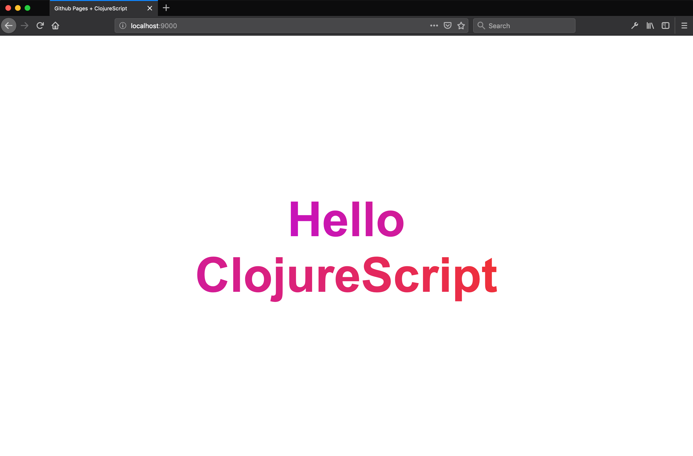

This blog will outline how to build a minimal static website using just HTML, CSS and ClojureScript. The cherry on top will be us deploying our site to Github Pages. My goal is to illustrate how straightforward this process can be and hopefully inspire some interest in ClojureScript. Before we begin let's review ClojureScript and Github Pages.

### What is ClojureScript?

ClojureScript, like [Elm](https://elm-lang.org) or [Reason](https://reasonml.github.io/), is a compile to js programming language. It's different from JavaScript because its data structures are immutable, its paradigm is functional and it's part of a family of programming languages called [lisp](<https://en.wikipedia.org/wiki/Lisp_(programming_language)>). The tangible benefits are that you can experience a world of web dev where classes of problems influenced by state and questionable language design are significantly reduced. If nothing else, ClojureScript is guarenteed to make you think different.

### Github Pages and Static Sites?

Github Pages is a service provided by Github which allows you to freely host your static website. For the uninitiated, a static website is when you write your website in plain old html, css and ~~javascript~~ ClojureScript. You don't need servers, databases or additonal server side code. The benefits include increased performance, a quick development workflow and enhanced website security. The downsides are that static websites will not be able to acheive all the cool features of a beefy web app.

With this in mind, let's start coding.

<aside class="blog-post__note">The rest of this article assumes that you have a Github account. If you don't, no worries. Take a moment and <a class="blog-post__link" href="https://help.github.com/en/articles/signing-up-for-a-new-github-account" target=" _blank" rel="noopener noreferrer">create one for free</a> or just sit back and enjoy the read. For those who do want to adventure with me, go through Github's official <a class="blog-post__link" href="https://pages.github.com/" target=" _blank" rel="noopener noreferrer">Github Pages Quickstart</a> for projects and follow it exactly.  Note that throughout this post I will have footnotes referencing my live <a class="blog-post__link" href="https://github.com/tkjone/demo-clojurescript-gh-pages" target="_blank" rel="noopener noreferrer">demo project</a> which has each step mirrored by its corresponding
<a class="blog-post__link" href="https://github.com/tkjone/demo-clojurescript-gh-pages/commits/master" target="_blank" rel="noopener noreferrer">commit</a>. Please lean on them if you feel lost at any point</aside>

Let's start by getting Clojure setup on your local machine. To do this, visit the [ClojureScript Quickstart](https://clojurescript.org/guides/quick-start) and follow the instructions there.

Not sure if you have everything setup properly? We can run a quick sanity check in your terminal by executing the following command:

```bash
clj -Stree
```

you should see a response like this:

```bash
org.clojure/clojure 1.10.0
  org.clojure/spec.alpha 0.2.176
  org.clojure/core.specs.alpha 0.2.44
```

<aside class="blog-post__note">Don't worry if your versions are different from mine.</aside>

### Setting up your HTML

For those that went through the Github Pages quickstart, you should have a repo with a sad little <a href="#fn-step-1-commit" aria-describedby="footnote-label" id="fn-step-1-commit-ref">index.html</a> inside of it. Open your `index.html` and add some life to it by making it look like this:

```html
<!DOCTYPE html>
<html>
  <head>
    <title>Github Pages + ClojureScript</title>
    <link rel="stylesheet" type="text/css" href="style.css" />
  </head>
  <body>
    <h1 class="site__title">
      <span class="site__title-text">Hello ClojureScript</span>
    </h1>
    <script src="/demo-clojurescript-gh-pages/out/main.js"></script>
  </body>
</html>
```

<aside class="blog-post__note">You will notice that we have added a reference to a js and css file in our HTML. We will add those later. Please also note that where it says "demo-clojurescript-gh-pages" in the script tag above, it should be the name of your Github project repo.</aside>

### Setting up your CSS

The next thing we want to do is add a `style.css` file at the same level as our `index.html` file so we can make our hello world look <a href="#fn-step-2-commit" aria-describedby="footnote-label" id="fn-step-2-commit-ref">gorg'</a>

```css
:root {
  --color-purple: rgba(197, 18, 193, 1);
  --color-pink: rgba(241, 50, 50, 1);
}

body {
  margin: 0;
  height: 100vh;
  display: flex;
  font-family: Arial;
  align-items: center;
  justify-content: center;
}

.site__title {
  font-size: 100px;
  width: 50%;
  text-align: center;
}

.site__title-text {
  background: -webkit-linear-gradient(
    34deg,
    var(--color-purple),
    var(--color-pink)
  );
  -webkit-background-clip: text;
  -webkit-text-fill-color: transparent;
}
```

Now that we have our HTML and CSS, we need to add ClojureScript.

### Setting up your ClojureScript

To do _anything_ with ClojureScript, we need to configure our project to use it. This begins by adding ClojureScript as a dependency. The way we do this in Clojure land is by creating a file called `deps.edn` at the same level as our <a href="#fn-deps" aria-describedby="footnote-label" id="fn-deps-ref"><code class="gatsby-code-text">index.html</code></a>. Once you have created your `deps.edn`, open it and add the following code:

```clojure
{:deps {org.clojure/clojurescript {:mvn/version "1.10.516"}}}
```

<aside class="blog-post__note">If you are coming from JavaScript it can be helpful to think of the <code class="gatsby-code-text">deps.edn</code> as similar to <code class="gatsby-code-text">package.json</code>. The purpose of this file is to tell <code class="gatsby-code-text">clojure</code> which version of <code class="gatsby-code-text">ClojureScript</code> we want to use.</aside>

Let's recap a bit. At this point, your directory structure should look like <a href="#fn-step-3-commit" aria-describedby="footnote-label" id="fn-step-3-commit-ref">this:</a>

```bash
.
├── deps.edn
├── style.css
└── index.html
```

If yes, we are good to move onto the next step: writing ClojureScript!

Like most code projects our code is going to live in a `src` directory. Go ahead and create a `src/demo` <a href="#fn-src-dir" aria-describedby="footnote-label" id="fn-src-dir-ref">directory</a>. Once created, move into `demo` and create our first ClojureScript file called `static_website.cljs`. Now our repo should look like <a href="#fn-step-4-commit" aria-describedby="footnote-label" id="fn-step-4-commit-ref">this:</a>

```bash

├── src
│   └──  demo
│       └── static_website.cljs
├── style.css
├── deps.edn
└── index.html
```

Once completed, open `static_website.cljs` and type this in:

```clojure
(ns demo.static-website)

(js/console.log "Hello, Github Pages!")
```

### Build development bundle

In the above steps, we have built a minimal site using HTML, CSS and ClojureScript so the last step is to make sure everything is working by running the following command:

```bash
clj -m cljs.main -d "demo-clojurescript-gh-pages/out"  -c demo.static-website -r
```

The above command will take a moment to run. When completed, a browser tab will automatically open and serve your HTM, CSS and ClojureScript. If everything worked you should see a site that looks like this:



Further, if you open your browser console you should see "Hello, Github Pages!"

<aside class="blog-post__note">If you are not seeing your ClojureScript in the browser console, please veryify that your <code class="gatsby-code-text">index.html</code> file is using your Github project name and the string following the <code class="gatsby-code-text">-d</code> in the above command, "demo-clojurescript-gh-pages", is also using your Github project <a href="#fn-project-name" aria-describedby="footnote-label" id="fn-project-name-ref">name</a>.</aside>

### Build production bundle

At this point we have shown ourselves that our code works locally, now it's time to show the world by deploying our site. Before we deploy, we need to build a production version by executing the following command:

```bash
clj -m cljs.main -O advanced -c "demo.static-website"
```

Once the above is done, rock a `git push` to your Github project repo and you should see your ClojureScript app live<a href="#fn-versioned-dependencies" aria-describedby="footnote-label" id="fn-versioned-dependencies-ref">!</a>

### Conclusion

As I noted in the beginning, this is a minimal example without 3rd party build tools, frameworks, libraries or conveniences and this the point. There are all kinds of routes you can take, but I hope that I have shown that ClojureScript can be an accessible tool for building static websites.

<aside>
  <h3>Footnotes</h3>
  <ol>
    <li id="fn-step-1-commit">
      <a class="blog-post__link" href="https://github.com/tkjone/demo-clojurescript-gh-pages/commit/90156bf57c1b80bd2e125909e8e7a584a53538c2" target="_blank" rel="noopener noreferrer">Commit</a>
      <a href="#fn-step-1-commit-ref" aria-label="Back to content">↩</a>
    </li>
    <li id="fn-step-2-commit">
      <a class="blog-post__link" href="https://github.com/tkjone/demo-clojurescript-gh-pages/commit/db9371431ab3288233cc5ec7ecd32f6c449c8d54" target="_blank" rel="noopener noreferrer">Commit</a>
      <a href="#fn-step-2-commit-ref" aria-label="Back to content">↩</a>
    </li>
    <li id="fn-deps">
       <code class="gatsby-code-text">deps.edn</code> is a newer, more beginner friendly way of setting up a Clojure(script) project.  Other popular alternatives include using tools like <a class="blog-post__link" href="https://leiningen.org/" target="_blank" rel="noopener noreferrer">lein</a> or <a class="blog-post__link" href="https://boot-clj.com/" target="_blank" rel="noopener noreferrer">boot</a>.  Having said this, I recommend using <code class="gatsby-code-text">deps.edn</code>.
      <a href="#fn-deps-ref" aria-label="Back to content">↩</a>
    </li>
    <li id="fn-step-3-commit">
      <a class="blog-post__link" href="https://github.com/tkjone/demo-clojurescript-gh-pages/commit/5d2c548cd995b4053ae677d5a6c64ccd2c3b58c6" target="_blank" rel="noopener noreferrer">Commit</a>
      <a href="#fn-step-3-commit-ref" aria-label="Back to content">↩</a>
    </li>
    <li id="fn-src-dir">
      The reason we are creating a  <code class="gatsby-code-text">demo</code> dir nested in a  <code class="gatsby-code-text">src</code> dir is because in Clojure(script) it's preferred to multi-segment our namespaces. This is both for <a class="blog-post__link" href="https://github.com/bbatsov/clojure-style-guide#no-single-segment-namespaces" target=" _blank" rel="noopener noreferrer">stylistic</a>  and <a class="blog-post__link" href="https://stackoverflow.com/questions/13567078/whats-wrong-with-single-segment-namespaces" target=" _blank" rel="noopener noreferrer">technical</a> reasons.
      <a href="#fn-src-dir-ref" aria-label="Back to content">↩</a>
    </li>
    <li id="fn-step-4-commit">
      https://github.com/tkjone/demo-clojurescript-gh-pages/commit/d0f31e3c2c981c0a736252f73b5f79a00ae08bb4
      <a href="#fn-step-4-commit-ref" aria-label="Back to content">↩</a>
    </li>
    <li id="fn-project-name">
      We are referencing  <code class="gatsby-code-text">demo-clojurescript-gh-pages</code> in our <code class="gatsby-code-text">index.html</code> and as the output directory for our development bundle.  The is because when our code is served from Github Pages it's going to be served from <code class="gatsby-code-text">https://username.github.io/project-name/</code> where <code class="gatsby-code-text">project-name</code> is the name of <a class="blog-post__link" href="https://tkjone.github.io/demo-clojurescript-gh-pages/" target=" _blank" rel="noopener noreferrer">our Github repo</a>.  This means that in order to serve our site in development and production, without having two script tags in our <code class="gatsby-code-text">index.html</code> we sync with what its called in production so we only have to set it once.  There are other ways to achieve this, but with a goal of minimalism in mind, I feel this will do.</a>
      <a href="#fn-project-name-ref" aria-label="Back to content">↩</a>
    </li>
    <li id="fn-versioned-dependencies">
      When you run the development or production build commands they will generate a bunch of code we do not need to version control.  For example, a <code class="gatsby-code-text">.cpcache</code>, <code class="gatsby-code-text">demo-clojurescript-gh-pages/out</code> and <code class="gatsby-code-text">out</code> dirs.  The only files you need to version control are the ones I have <a class="blog-post__link" href="https://github.com/tkjone/demo-clojurescript-gh-pages/tree/master" target="_blank" rel="noopener noreferrer">here</a>.  The other ones can be ignored.  If you're curious what that that looks like I have created a <a class="blog-post__link"  target="_blank" href="https://github.com/tkjone/demo-clojurescript-gh-pages/tree/level-2-what-to-version-control" rel="noopener noreferrer">level 2</a> branch to show you.
      <a href="#fn-versioned-dependencies-ref" aria-label="Back to content">↩</a>
    </li>

  </ol>
</aside>
