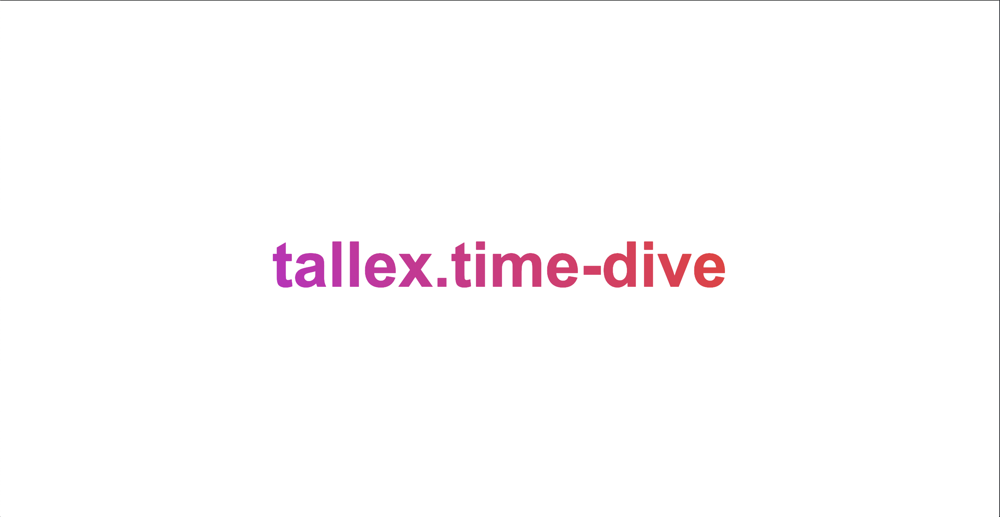

ClojureScript rewards you for having more than a passing acquaintance with software testing practices. The community has provided great tools, but you do need to know how, why and when to use them<a href="#intro-to-testing" aria-describedby="footnote-label" id="intro-to-testing-ref">.</a>

Because we are focusing on the early steps of test toolchain setup this post will not discuss testing strategies like TDD, best practices, how to use libraries or even writing ClojureScript.  We are dedicated to understanding _how_ to setup our toolchain.

<aside class="blog-content__note">If you are following along please make sure you have Clojure setup on your local machine.  To do this, visit the <a  class="blog-content__link" href="https://clojurescript.org/guides/quick-start" target="_blank" rel="noopener noreferrer">ClojureScript Quickstart</a> and follow the instructions there.</aside>

## ClojureScript Project Setup

To begin, we need a demo ClojureScript project to work from.  To do this I have made a ClojureScript app builder called `create-reagent-app` which automatically builds a modern ClojureScript app for us.  All you need to do is move to a directory where you want your project to live and run the following command:

```bash
clj -Sdeps '{:deps
              {seancorfield/clj-new {:mvn/version "1.0.199"}}}' \
  -m clj-new.create \
  https://github.com/tkjone/create-reagent-app@ac511417d2710b0fc514c38dcdb789e3d05461f2 \
  tallex/time-dive
```

<aside class="blog-content__note">The above command uses <a  class="blog-content__link" href="https://github.com/seancorfield/clj-new" target="_blank" rel="noopener noreferrer">clj-new</a> to generate a modern ClojureScript app. Think of it like the ClojureScript version of <a class="blog-content__link" href="https://create-react-app.dev/" target="_blank" rel="noopener noreferrer">create-react-app</a>. If you're curious about this project template your can read more about it in an earlier post I wrote here: <a  class="blog-content__link" href="https://betweentwoparens.com/start-a-clojurescript-app-from-scratch" target="_blank" rel="noopener noreferrer">Start a ClojureScript App from Scratch</a>.</aside>

Once the above command finishes running you will have a project called `time-dive`.  It should look like this:

```bash
time-dive
├── README.md
├── deps.edn
├── dev.cljs.edn
├── resources
│   └── public
│       ├── index.html
│       └── style.css
├── src
│   └── tallex
│       └── time_dive.cljs
└── test
    └── tallex
        └── time_dive_test.cljs
```

Let's take a beat and make sure this magic works.  Run the following command from the root of `time-dive`:

```bash
clj -A:dev
```

If everything worked a new browser window should automatically open to http://localhost:9500/ and you should see the following:



Kowabunga? Let's write some ClojureScript!

## Writing a Simple Test

In this section we will write a simple ClojureScript function and a test for said function.

Open `time_dive.cljs` and make the whole thing look like this:

```clojure
(ns tallex.time-dive)

(defn add
  [a b]
  (+ a b))
```

<aside class="blog-content__note">You will have noticed that the above file had some code in it. It's good code, but for this post let's delete it all and just use the above.  You could also just leave that code in place, but for clarity I will demo this with only the <code class="gatsby-code-text">add</code> fn in this <code class="gatsby-code-text">namespace</code>.</aside>

Now let's write a test for our `add` function.  Open `time_dive_test.cljs` and write a simple test:

```clojure
(ns tallex.time-dive-test
  (:require
    [cljs.test        :refer-macros [deftest is]]
    [tallex.time-dive :as time-dive]))

(deftest test-add-function
  (is (= (time-dive/add 1 1) 2)))
```

<aside class="blog-content__note">Two notes about the implicit: <strong>First</strong>, for every Clojure(Script) file we will have a corresponding test file. The test file will share the name of the ClojureScript file it is testing.  The only difference is that we suffix it with <code class="gatsby-code-text">_test</code>.  This a common convention.  <strong>Secondly</strong>, notice that we are able to use <code class="gatsby-code-text">cljs.test</code> but we did not import it? This is because <code class="gatsby-code-text">cljs.test</code> is <a class="blog-content__link" href="https://clojurescript.org/tools/testing" target="_blank" rel="noopener noreferrer">shipped with ClojureScript</a>.</aside>

`cljs.test` is a minimal library with everything you need to test ClojureScript<a href="#cljs-test" aria-describedby="footnote-label" id="cljs-test-ref">.</a>  Specifically it comes with **assertion library** and **test runner** tools.  The above test introduces you to the following **assertion library** syntax and helpers:

- `deftest` defines a test
- `test-add-function` is a name of our tes<a href="#test-add-fn" aria-describedby="footnote-label" id="test-add-fn-ref">t</a>
- `is` syntax is a convenience wrapper around a try-catch block

<aside class="blog-content__note"><strong>assertion libraries</strong> is the first category of testing tools we have introduced.  As a rule of thumb they provide us syntax like <code class="gatsby-code-text">is</code> and helpers like <code class="gatsby-code-text">deftest</code> for confirming that the code we have written is correct.</aside>

All of this combined is us telling ClojureScript that we have a test and how ClojureScript should handle fails/passes.

Now is a good time to note that `cljs.test` is not the only testing library in town.  If you are interested in exploring alternatives, feel free to have a look at these assertion libraries:

- [expectation](https://github.com/clojure-expectations/expectations)
- [testit](https://github.com/metosin/testit)
- [midje](https://github.com/marick/Midje)
- [fudje](https://github.com/jimpil/fudje)

And you can even lean on the JavaScript ecosystem if you like.  For example, I was able to get [Jest working with ClojureScript](https://github.com/athomasoriginal/demo-clojurescript-jest)<a href="#jest-clojurescript" aria-describedby="footnote-label" id="jest-clojurescript-ref">.</a>

For now I recommend sticking with `cljs.test` and then look into one of the above when/if the need arises.

At this point, you see that we have written a test but how do we actually run the test? Before we get to the answer, let's quickly jump over to a brief history lesson of JS environments.

## Understanding JS Test Environments

ClojureScript is cool because you don't have to think too much about where your code is evaluated when it's run in the repl.  You send your code to the repl, the code is compiled from ClojureScript to JavaScript and then the JavaScript produced is sent to a JS environment.

What is this JS Environment?  Is it node?  a browser?  The answer is that it depends on how you run your repl.  If you do `clj -m cljs.main` your code will be evaluated in the browser that opens.  If you are using `lumo` your code is evaluated in Node.  This is what I mean when I say JS Environment.

By default you really don't have to care about where your code runs when coding in the repl, but when you write tests you should understand where the code is run because you will have an easier time reasoning through which tools you need and how to configure them.

<aside class="blog-content__note">Please don't be turned off by this.  You would have to understand this even if you were writing vanilla JavaScript.  The difference is that you won't run into this wall as early in JavaScript because JavaScript builds walls of tools that cover it up...until you need to know why things behave the way they do and then you have to tear down the wall brick-by-brick</aside>

Okay, so how do I know which JS Environment I care about?  The answer is that it depends on your apps `target`.  Are you writing for the browser? mobile? server?  The `target` impacts what you care about.

For example, if you are writing for the server, you don't need to care about browser testing.  Seems obvious, but it can trip people up when thinking about ClojureScript because ClojureScript is by default meant to be run in the browser but it can also run on the server and on mobile.  Yet the most common use case is the browser which means that when people write guides about testing they are often implicitly thinking about browser like JS environments.

Okay, but why does environment matter?  This is because while you could give the exact same piece of JavaScript to a JS Environment, not all JS environments will run it in the same way.  ClojureScript is special because it compiles down [ECMAScript 3](http://www.jiehuang.net/wordPress/uncategorized/ecmascript/) which means we are able to run in many environments with confidence so this part is not as big of a concern.  The bigger concern is that a Node JS Environment does not have the DOM.  This is a browser thing.

Enough history.  Let's setup our app to run our code in the browser!

## Browser Testing

Just like the main app code, our test code needs an [entrypoint](https://betweentwoparens.com/start-a-clojurescript-app-from-scratch#step-4---add-clojurescript).  The entrypoint is a small program that knows how to find and run all of our tests.  Thus, the entrypoint needs tools from a category of test tooling called **test runners**.  You have have heard of tools like [Doo](https://github.com/bensu/doo) being used for this, but with figwheel + `cljs.test` we do not need Doo<a href="#doo" aria-describedby="footnote-label" id="doo-ref">.</a>

To begin, let's setup figwheel to run our tests.  Add a new namespace called `test_runner.cljs` inside of our `test/tallex` directory.  Once completed our project should look like this:

```bash
time-dive
├── README.md
├── deps.edn
├── dev.cljs.edn
├── resources
│   └── public
│       ├── index.html
│       └── style.css
├── src
│   └── tallex
│       └── time_dive.cljs
└── test
    └── tallex
        ├── test_runner.cljs # new
        └── time_dive_test.cljs
```

Open up `test_runner.cljs` and add the following

```clojure
(ns tallex.test-runner
  (:require
    [cljs-test-display.core]
    [figwheel.main.testing :refer-macros [run-tests]]
    [tallex.time-dive-test]))

(run-tests (cljs-test-display.core/init! "app-testing"))
```

<aside class="blog-content__note">Notice that we are using <code class="gatsby-code-text">run-tests</code> from figwheel.  This fn is going to automatically find all the tests we require into this file in our app and run them for us.  It's a convenience function.</aside>

The next step is to open your `dev.cljs.edn` file and add the following:

```clojure
^{:watch-dirs       ["src" "test"]
  :css-dirs         ["resources"]
  :extra-main-files {:testing {:main tallex.test-runner}}} ; new
{:main tallex.time-dive}
```

That's everything.  With this we can now run our tests.  If you still had your app running from earlier please stop the server and run `clj -A:dev` again.  If everything worked the browser will automatically open again, but it will be blank this time (remember that we deleted the Reagent code earlier). What we want to do now is visit http://localhost:9500/figwheel-extra-main/testing. This is an endpoint that figwheel automatically gives us when we specify `:extra-main-files` like we did.

Here is where things get fun.  Go into `tallex.time-dive-test` and change the test to look like this:

```clojure
(deftest test-add-function
  (is (= (time-dive/add 1 1) 1))) ; new
```

When you save the file your browser will automatically reload and should tell you it failed.  Revert that change and go into `tallex.time-dive` and change the add function to look like this:

```clojure
(defn add
  [a b]
  (- a b)) ;new
```

Once again a quick save will see the browser live update and again your tests will fail.  This is what makes this workflow powerful.  You have a quick test feedback loop.  Further, if you want to test this code in different browsers just open the URL in a different browser.  Win.

This is the basis for a test-runner and browser testing.  However, maybe you want to enhance the `test_runner.cljs`.  This is why the following tools were created:

- [eftest](https://github.com/weavejester/eftest)
- [kaocha](https://github.com/lambdaisland/kaocha)

To review: we setup our app with a quick browser testing workflow, but what about if we want to run our tests in a CI environment?  I show you.

## Headless Browser Testing

As I mentioned, the above method of testing is awesome for local development but why and how do we run our tests in our CI environment?

The why of it is this:  we don't need a browser GUI to run in our CI Environment.  The GUI is slow and performance intensive.  For this reason, we should consider setting up our tests to run in a headless environment.  Here are some example of headless JS environments

- [headless chrome](https://chromium.googlesource.com/chromium/src/+/lkgr/headless/README.md)
- [Nightmare](http://www.nightmarejs.org/)
- [Puppeteer](https://github.com/GoogleChrome/puppeteer)
- [jsdom](https://github.com/jsdom/jsdom)

For our purposes we are going to use [jsdom](https://github.com/jsdom/jsdom) which is a node based browser like environment.  My preference here is because `jsdom` is a fast, healthy open source project backed with great documentation and battle tested.  Evidence?  companies like [Gitlab](https://docs.gitlab.com/ee/development/testing_guide/frontend_testing.html), [Facebook](https://opensource.facebook.com/) and [Airbnb](https://www.airbnb.ca/) support their extensive testing infrastructure with `jsdom`.

What I will illustrate in this section is how to setup figwheel to run your ClojureScript tests in `jsdom` and then how to run them from the command line.  This section is going to be a little more interesting because we need to lean on the javascript ecosystem so I will try to be as clear as possible.

<aside class="blog-content__note">housekeeping: ensure you have <a class="blog-content__link" href="https://yarnpkg.com/en/docs/getting-started" target="_blank" rel="noopener noreferrer">yarn</a> and <a class="blog-content__link" href="https://nodejs.org/en/" target="_blank" rel="noopener noreferrer">node</a> installed before continuing. You can also swap out <code class="gatsby-code-text">yarn</code> for <code class="gatsby-code-text">npm</code>.</aside>

### Step 1 Add JavaScript Dependencies

Since we are going to be using packages from JavaScript land we need to setup our ClojureScript with a `package.json` file.  To do this we can run this from the root of our tallex project:

```bash
yarn init -y
```

<aside class="blog-content__note"><code class="gatsby-code-text">-y</code> will tell yarn to say yes to all of its questions.</aside>

The above will create a `package.json` file for us and a `yarn.lock`.  The next step is to install `jsdom`:

```bash
yarn add -D jsdom
```

<aside class="blog-content__note"><code class="gatsby-code-text">-D</code> flag will tell our js that this dependency is for development only.</aside>

The above will take a short while and when complete your `package.json` will have been updated and you will have a `node_modules` dir in your repo. Your project should now look like this:

```bash
time-dive
├── README.md
├── deps.edn
├── dev.cljs.edn
├── package.json  # new
├── yarn.lock     # new
├── node_modules/ # new
├── resources
│   └── public
│       ├── index.html
│       └── style.css
├── src
│   └── tallex
│       └── time_dive.cljs
└── test
    └── tallex
        ├── test_runner.cljs
        └── time_dive_test.cljs
```

### Step 2 Setup a JSDOM Environment

Now we need to write some JavaScript.  Inside of `test/tallex` create a file called `test_environment.js` and make it look like this:

```javascript
// ------------------------------------------------------------
// Browser Test Environment - JSDOM
// ------------------------------------------------------------

const fs = require('fs');
var vm = require('vm');
var path = require('path');
const jsdom = require ('jsdom');

const args = process.argv.slice(2)
const testScript = args[0];
const url = args[1];

// helpers
function addScript (fname, window){
  var scriptText =  fs.readFileSync(fname, { encoding: "utf-8" });
  var scriptEl = window.document.createElement("script");
  scriptEl.text = scriptText;
  window.document.body.appendChild(scriptEl);
}

// setup JSDOM options
const {JSDOM, VirtualConsole} = jsdom;

const html = '<!DOCTYPE html>';

const virtualConsole = new VirtualConsole()

const options = {
  // see https://github.com/jsdom/jsdom#loading-subresources
  url:  url,
  resources: "usable",
  runScripts: "dangerously",
  pretendToBeVisual: true,
  // see https://github.com/jsdom/jsdom#virtual-consoles
  virtualConsole: virtualConsole.sendTo(console)
};

// create JSDOM instance
const dom = new JSDOM(html, options);

global.window = dom.window;

// run tests
addScript(testScript, dom.window);
```

<aside class="blog-content__note">The above is going to look like a lot of code.  90% of it is directly from the jsdom docs.  The only things I have added are comments and some helper functions to make it more maintainable.</aside>

The above is just a JavaScript file meant to be run by node.  You can manually call it by running:

```bash
node test_environment.js file.js url
```

At which point your `file.js` will be run inside of `jsdom`.  In our case, we are going to give `jsdom` the name of our clojurescript file compiled by figwheel. The tests will run inside of `jsdom` and the results of those tests will be returned to us.

To help understand the above script a little more:

- `addScript` a function that is going to write our file to the `jsdom` environment which is what makes the script run
- `VirtualConsole` is a `jsdom` config that allows the output to be returned to the console.  For example, if you write `(js/console.log "hi")` in your tests, this line is what will return it to the console.
- `url` this is for when you want to setup jsdom to pickup figwheel changes.  Your files are served by the figwheel server at the url you provided, so this let's us do more interesting things.

Alright, from here we are done with JavaScript and we can go back to configuring our ClojureScript project.

### Step 3 Setup A Headless Test Runner

We need to create a second test-runner which is going to be used to run our headless tests. So create a new file called `test_runner_headless.cljs` inside of `tests/tallex` and make it look like this:

```clojure
(ns tallex.test-runner-headless
  (:require
    [figwheel.main.testing :refer-macros [run-tests-async]]
    ; tests here
    [tallex.time-dive-test]))

(defn -main [& args]
  (run-tests-async 10000))
```

This file is the `entrypoint` for our tests.  It's this file that will be run in `jsdom`.  The next step is to write the code that will run our `jsdom` JS environment

### Step 4 JS Environment Runner

Figwheel does this great thing where it allows us to choose the JS environment where you want to run your code.

In the [browser testing](#browser-testing) section we let figwheel choose which JS environment to run our code in.  Now we want to do something different.  We want to tell figwheel the JS environment to run our tests in.  In order to do this we need to write a Clojure file.  Yup, we are writing Clojure.

Create a new file in `test` called `tallex.clj` and add the following code:

```clojure
(ns tallex
  (:require
    [clojure.java.shell :as shell]))

(defn run-js-test-environment
  [{:keys [output-to open-url] :as args}]
  (let [js-env "test/tallex/test_environment.js"
        result (shell/sh "node" js-env output-to open-url)]
    (if (zero? (:exit result))
      result
      (do (println result)
          (System/exit 0)))))
```

<aside class="blog-content__note">For those not familiar with <code class="gatsby-code-text">clojure.java.shell</code> it is going to return a map with an <code class="gatsby-code-text">:exit</code> code of <code class="gatsby-code-text">0</code> or <code class="gatsby-code-text">1</code>.  If it is <code class="gatsby-code-text">1</code> that means something has gone wrong and your process will just hang and tell you nothing about what went wrong.  For example, pretend you skipped step 1 - 2 of this section.  If you run the above, node will throw an error saying that you do not have jsdom installed.  However, you will not know this because <code class="gatsby-code-text">clojure.java.shell</code> will silently eat that message and
<a class="blog-content__link" href="https://clojureverse.org/t/why-doesnt-my-program-exit/3754/1" target="_blank" rel="noopener noreferrer">just do nothing</a>.  So what we do is provide a little developer convenience and add a check.  If anything goes wrong we print it and then kill the program.</aside>

When we call `run-js-test-environment` it is ultimatley responsible for running `node test_environment.js file.js url` like we illustrated in [Step 2 Setup a JSDOM Environment](#step-2-setup-a-jsdom-environment).

Awesome.  At this point we have our depenencies, a JS environment and a test runner.  The last step is to configure figwheel.

### Step 5 Configure Figwheel

The first step is adding a new `build configuration` for figwheel.  We cannot use our old `dev.cljs.edn` one because that is running our app/browser tests so what we need is a new one which is specifically geared towards running our headless JSDOM env.  I suppose the rule of thumb here is that everytime your need to run your ClojureScript in a different JS environment, whether that is node or browser, you need a different build configuration.  Create a new file called `test.headless.cljs.edn` and make it look like this:

```clojure
^{:launch-js tallex/run-js-test-environment}
{:main tallex.test-runner-headless}
```

Now from here we need to create an alias in our `deps.edn` file:

```clojure
{:paths
 ["src" "test" "resources" "target"]

 :deps
 {org.clojure/clojurescript {:mvn/version "1.10.773"}

  com.bhauman/figwheel-main {:mvn/version "0.2.6"}

  reagent                   {:mvn/version "0.10.0"}}

 :aliases
 {:dev
  {:main-opts ["-m"  "figwheel.main" "--build" "dev" "--repl"]}

  :test-headless ; new alias
  {:main-opts ["--main"         "figwheel.main"
               "--compile-opts" "test.headless.cljs.edn"
               "--main"         "tallex.test-runner-headless"]}}}
```

That's it.  We are ready to run our headless browser testing setup.  Try it out by running `clj -A:test-headless` in your terminal.

If it all worked you should see something like this:

```bash
# ...

Testing tallex.time-dive-tests

Ran 1 tests containing 1 assertions.
0 failures, 0 errors.
Tests passed!
```

You are going to notice that you have to re-run this everytime you want to run your headless tests.  This is to be expected. The thing with this approach is that we have only really configured it to be run by our CI environment and also as a quick sanity check for newcomers to our project.  Could we make it do more?  Yup!  You can take this and connect it to figwheel's file watching machanism and have it behave exactly like the browser testing setup.

In addition, while I have chosen to use `jsdom` you could choose to use any headless JS environment you like!


## Next Steps

At this point you have a complete test workflow and you can start doing interesting things like writing tests.

In all seriousness though, this is just a starting point.  Set this up for yourself, play with it and improve on it!  Also take a look at these resources for more information on ClojureScript / JavaScript testing.

- [Testing Your Application - CLJS](https://hub.packtpub.com/testing-your-application-cljstest/)
- [Figwheel Testing Guide](https://figwheel.org/docs/testing.html)
- [JavaSCript and Node Best Practices](https://github.com/goldbergyoni/javascript-testing-best-practices)


<aside>
  <h3>Footnotes</h3>
  <ol>
    <li id="intro-to-testing">
      This might be redundant because you need to have this knowledge no matter what you are doing with programming, but I have always felt testing requires a greater understanding than just slapping down application code.
      <a href="#intro-to-testing-ref" aria-label="Back to content">Back</a>
    </li>
    <li id="cljs-test">
      It is also maintained by the ClojureScript core team you can feel confident that it is a healthy tool to use.
      <a href="#cljs-test-ref" aria-label="Back to content">Back</a>
    </li>
    <li id="test-add-fn">
      You can name the test anything you like. There are many idiomatic conventions for this so I recommend you do a little research into naming/structuring tests and find one that aligns with your sensibilities.
      <a href="#test-add-fn-ref" aria-label="Back to content">Back</a>
    </li>
    <li id="jest-clojurescript">
      This is a viable option, but probably needs a little work for it perform well as your project scales.  The other downside is you are opting out of the ClojureScript ecosystem a little can be frustrating.  This is the reason that while I explored this option, I opted for stay in the CLJS ecosystem.
      <a href="#jest-clojurescript-ref" aria-label="Back to content">Back</a>
    </li>
    <li id="doo">
      I don't mean to sound like I am throwing Doo under the bus, but Doo is often mentioned hand-in-hand with ClojureScript and test-runners so I wanted to make the distinction early that Doo is one of many tools, but really is not needed to setup your test workflow.
      <a href="#doo-ref" aria-label="Back to content">Back</a>
    </li>
  </ol>
</aside>
