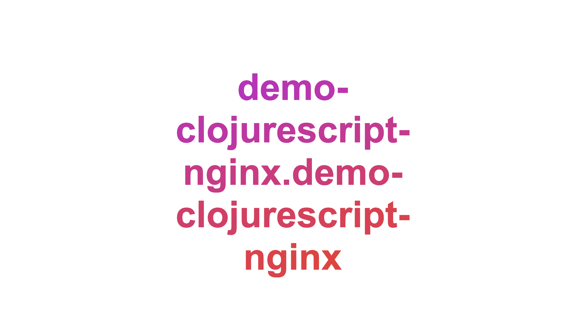

My [first blog post](https://betweentwoparens.com/deoploy-clojurescript-to-github-pages) outlined how to deploy a static ClojureScript website to Github Pages. This is an excellent choice for personal websites, or an open source project's documentation because you get free hosting infrastructure with relatively little effort.  Having said this, what happens if you can't use static hosting providers like Github Pages or [Netlify](https://www.netlify.com/)?  What if you need to control more of the hosting service?  This post will show you how to deploy your ClojureScript site on a webserver you control.  Specifically, we will cover the following topics:

- [The Deploy Process](#the-deploy-process)
- [Housekeeping](housekeeping)
- [Create App](#create-app)
- [Sanity Check Webserver](#sanity-check-webserver)
- [Build Production Artifacts](#build-production-artifacts)
- [Move Production Artifacts to Webserver](#move-production-artifacts-to-webserver)
- [Teach Webserver to Serve Artifacts](#teach-webserver-to-serve-artifacts)
- [Automate Process](#automate-process)

By the time we are finished I hope to have clarified the general steps involved in hosting your own ClojureScript app (**spoiler:** it's the same as hosting a JavaScript app).

<aside class="blog-post__note">Beyond creating a simple ClojureScript app, this post is not really about ClojureScript. I see it's role as clearing up the process of deploying a static site.  Specifically, we will focus on deploying ClojureScript to a webserver (<a class="blog-post__link" href="https://www.nginx.com/" target="_blank" rel="noopener noreferrer">Nginx</a>).  If you are following along, you can see the <a class="blog-post__link" href="https://github.com/athomasoriginal/demo-clojurescript-nginx" target="_blank" rel="noopener noreferrer">source code here</a>.</aside>

## The Deploy Process

In order to make our site available to the internet we need a `physical webserver` and `software webserver`.  Once we have these, we just have to:

1. Store your website's artifacts (`html`, `css` and `js`) on a `physical server`
1. Teach your `software webserver` where those files live

In order to do the above, we need to perform the following steps:

1. Build your website's production artifacts
2. Move your website's  production artifacts to a `physical webserver`
3. Configure your `software webserver` to deliver your website's artifacts to users

These steps are the same whether you are writing `JavaScript`, `ClojureScript`, `Reason` or any other web ready language.

In order to illustrate the deploy process we are going to:

1. use the computer you are on right now as your `physical server`
2. use [Nginx](https://www.nginx.com/) as our `software server`
3. use `ClojureScript` for our static website
4. use [docker](https://www.docker.com/) to make the deploy consistent and predictable

<aside class="blog-content__note">We are using <code class="gatsby-code-text">Nginx</code> because as far as webservers go it's easy to setup, configure and find documentation for.  Finally, because it's ready to use you can use this solution in your workplace today to quickly deploy static documentation or a prototype app.</aside>

## Housekeeping

If you are going to follow along with this post please make sure you have the following tools installed:

- Install [Docker](https://docs.docker.com/v17.09/engine/installation/)<a href="#why-docker" aria-describedby="footnote-label" id="why-docker-ref"></a>
- Install [Clojure](https://clojurescript.org/guides/quick-start)

## Create App

<aside class="blog-content__note">This whole process starts with a ClojureScript app.  If you already have an app you can skip this part.  If you don't have an app, please follow along with this section and we will set you up with your very own ClojureScript app.</aside>

We will create our ClojureScript app using [Create Reagent App](https://github.com/athomasoriginal/create-reagent-app).  This is a tool which automatically builds a modern ClojureScript/Reagent (READ: React) app for us.  All you need to do is move to a directory where you want your project to live and run the following command:

```bash
clj -Sdeps '{:deps
              {seancorfield/clj-new {:mvn/version "0.9.0"}}}' \
  -m clj-new.create \
  https://github.com/athomasoriginal/create-reagent-app@8c17f0f454f631f9238aed6be19aa1ca3c78f0d4 \
  demo-clojurescript-nginx/demo-clojurescript-nginx
```

Once the above is complete you should have a project that looks like this:

```bash
.
├── README.md
├── deps.edn
├── dev.cljs.edn
├── resources
│   └── public
│       ├── index.html
│       └── style.css
├── src
│   └── demo_clojurescript_nginx
│       └── demo_clojurescript_nginx.cljs
└── test
    └── demo_clojurescript_nginx
        └── demo_clojurescript_nginx_test.cljs
```

<aside class="blog-content__note">This app comes with commands for running the app in <code class="gatsby-code-text">dev</code> and building a <code class="gatsby-code-text">production</code> version of the app.  The commands are <code class="gatsby-code-text">clj -A:dev</code> and <code class="gatsby-code-text">clj -A:prod</code> respectively.  Feel free to play with the app.</aside>

## Sanity Check Webserver

In this section, I want to spend some time making sure the lightbulbs are working before we decorate the tree.  We are going to verify that we can use docker to pull and run an `Nginx` container locally. To begin, `pull` an nginx docker image into your local filesystem:

```bash
docker pull nginx
```

We can verify that the image was successfully pulled in by running the following command

```bash
docker images
```

and if all went well we should see an `Nginx` image in your local filesystem like:

```bash
REPOSITORY  TAG    IMAGE ID     CREATED     SIZE
nginx       latest 540a289bab6c 3 days ago  126MB
```

If that went well, we can try to run our nginx docker container

```bash
docker run --name demo-clojurescript-nginx -p 80:80 -d nginx
```

and once again we will verify that the container is running

```bash
docker ps -a
```

and you should see something like

```bash
CONTAINER ID  IMAGE  COMMAND                  CREATED        STATUS
9118c08ed0a6  nginx  "nginx -g 'daemon of…"   6 seconds ago  Up 4 seconds
```

and now you should be able to visit your docker container at `http://localhost:80`.  This step was like checking that the all the lightbulbs work before you hang them on the tree.  With this, we can go on to the meat and potatoes of the excercise.  Before continuing on, be sure to stop your `Nginx` docker container:

If this worked, we are ready to deploy our site `Nginx`.  What we are going to do is start by manually deploying our app so we can understand the manual steps and then automate things using `docker` (because we're lazy boys).

Before we continue, make sure you stop your `Nginx` docker container and remove it like so:

```bash
docker stop demo-clojurescript-nginx \
&& docker rm demo-clojurescript-nginx
```

and let's start it again except this time we will start it on port `4001`.

```bash
docker run --name demo-clojurescript-nginx -p 4001:4001 -d nginx
```


## Build Production Artifacts

This section is about building production artifacts.  To clear things up, when I say `artifact` I mean the code that will be run by our webserver.  In the case of a web development project, the `artifact` will be the minified and dead code eliminated JavaScript produced by the ClojureScript compiler.

To create this artifact we have to tell the ClojureScript compiler to build it for us.  We do this with the following command:

```bash
clojure -A:prod
```

After the above command is run we can verify that we have a production `artifact` by looking into the `out` directory and finding a file called `dev-main.js`

```bash
out
├── cljs
│   ├── core
│   ├── core.cljs
│   └── core.js
├── dev-main.js
...more stuff
```

If that has worked, we can move to the next step: putting our production artifacts on the `physical webserver` (docker container).

## Move Production Artifacts to Webserver

This step is about creating a place for our production artifacts to live. To do this, we are going to manually go inside our nginx container and create the folder structure.

```bash
docker exec -it demo-clojurescript-nginx bash
```

and how create the folder like this:

```bash
mkdir -p var/www/app/cljs-out
```

and then exit the docker container.  From here we can move the production artifacts from our local machine to the docker container.

```bash
# move the js artifact
docker cp out/dev-main.js demo-clojurescript-nginx:var/www/app/cljs-out/
# move the css artifact
docker cp resources/public/style.css demo-clojurescript-nginx:var/www/app/style.css
# move the html artifact
docker cp resources/public/index.html demo-clojurescript-nginx:var/www/app/index.html
```

From here, we just have to teach our webserver how to serve these files.

## Teach Webserver to Serve Artifacts

At this point we just have to configure our `Nginx` server to know where our production artifacts live.  To do this, we have to remove the default `Nginx` configuration file and replace it with a new one.

Start by execing into the `Nginx` docker container:

```bash
docker exec -it demo-clojurescript-nginx bash
```

Remove the old configuration file:

```bash
rm /etc/nginx/nginx.conf
```

Then exit out of the docker container.  At this point, we want to create a custom configuration file called `nginx.conf`.  This configuration file will live in the root of our ClojureScript app in a folder structure like `tools/nginx/nginx.conf` inside the root of our `demo-clojurescript-nginx` ClojureScript app.  So go ahead and create the folder structure:

```bash
mkdir -p tools/nginx && touch tools/nginx/nginx.conf
```

and then you can open `nginx.conf` and make it look like this:

```bash
events {}

http {

  include mime.types;

  gzip on;
  server_tokens off;

  server {
    listen 4001;
    root /var/www/app;
  }
}
```

Now we want give this `nginx.conf` file to our `Nginx` container so it knows how and where to serve our project from.  To do this, run the following command:

```bash
docker cp tools/nginx/nginx.conf demo-clojurescript-nginx:etc/nginx/nginx.conf
```

at this point we want to stop our docker container so the configuration file takes effect

```bash
docker stop demo-clojurescript-nginx
```

and then we can start the container again.

```bash
docker start demo-clojurescript-nginx
```

Now we should be able to visit our site at `http://localhost:4001` and see the following:




## Automate Process

You may have noticed, but the above process is a manualy process.  The point was to show you exactly what the process looks like if you have to manually run it.  Now though, we want to show the automated flow using docker.

### Automate Prod Artifact Builds

Go into the `tools/nginx` directory and create a file called `Dockerfile.build` and make it look like this:

```docker
# base image
FROM clojure:openjdk-11-tools-deps-slim-buster

# create dir for our app to live in
WORKDIR /app

# copy the app from our local filesystem to the docker container app dir
COPY . /app

# build our prod clojurescript artifact
RUN clojure -A:prod

# The end.  No need for a CMD to be specified because this is a build
# docker containers
```

<aside class="blog-content__note">In the above the goal is really to keep everything as light as possible. We just want <code class="gatsby-code-text">Java</code> so we can build our project and if you have to build anything with <code class="gatsby-code-text">node</code> you will have to also add that to the docker container.  Stuff you might do with node?  Build your style sheets?  Run tests in a headless environment? etc. It's going to download eveything and then run the container.</aside>

A few things to note:
- we use `clojure` rather than `clj` as `clj` include `rlwrap`, but they are the same for our purposes.
- when you run this container you want to run it from the root of the app
- will copy everything in the root project to a generically name folder called `app`

This docker file is responsible for building our artifacts that we performed in step 2 earlier.  Now lets go ahead and move to the root of our project and run that dockerfile and see if everything works:

```bash
docker build -t \
             demo-clojurescript-nginx/build:0.0.0 \
             -f "tools/nginx/Dockerfile.build" .
```

The above is going to build our image and the production clojurescript object.  The next step is to run a container based off the above image so that we can get the production artifacts

```bash
docker run -d \
           --name demo-clojurescript-nginx-build \
           demo-clojurescript-nginx/build:0.0.0 \
           sleep 20000
```

<aside class="blog-content__note">If you curious about the content of your docker build container you can exec into it like this <code class="gatsby-code-text">docker exec -it demo-clojurescript-nginx-build bash</code>.</aside>

### Move Production Artifacts to Local FileSystem

At this point, we want to copy the built files from the docker container to our local machine.  If this were running in a CI/CD process we would have a special spot in the CI/CD environment for these temporary files.  Because this is our local system, we have to create a temporary place for these things to live.  Lets call this place `temp/cljs-out` and we will create it in the root of our `demo-clojurescript-nginx` repo.

```bash
mkdir -p temp/cljs-out
```

from here we can grab the files from our `Dockerfile.build` container and move them to our temp dir like this:

```bash
docker cp demo-clojurescript-nginx-build:app/resources/public/index.html ./temp/index.html
docker cp demo-clojurescript-nginx-build:app/resources/public/style.css ./temp/style.css
docker cp demo-clojurescript-nginx-build:app/out/dev-main.js ./temp/cljs-out/dev-main.js
```

<aside class="blog-content__note">Note that if you are running in CI/CD tool like circleci or travis or anything really the whole manual copy things over step does not have to be done because there is a temporary file system there where you can store things.  In our case, we are setting this up to run locally so we will create a holding place in our repo which will act as this temporary file system.</aside>

### Automate Nginx Configuration

The next step is automate step 3 from above: nginx configuration and moving the artifacts from the above to the nginx container.  To do this, we need to build our own nginx container which is going to be the docker container you would actually run.  SO go ahead and create another docker container inside of `tools/nginx` called `Dockerfile` which looks like this:

```bash
# base image
FROM nginx:1.17.5

# remove the default nginx configuration
RUN rm /etc/nginx/nginx.conf

# add custom nginx configuration
COPY ./tools/nginx/nginx.conf /etc/nginx

# allow nginx conf to be executable
RUN cd /etc/nginx \
    && chmod +x /etc/nginx/nginx.conf

# create working directory
WORKDIR /var/www/app

# copy our temp artifacts
COPY ./temp /var/www/app

# start nginx container
CMD /bin/bash -c "nginx -g 'daemon off;'"
```

now build the image

```bash
docker build -t \
             demo-clojurescript-nginx/prod:0.0.0 \
             -f "tools/nginx/Dockerfile" .
```

and before we run our final image stop any instances of `Nginx` docker containers you may still have running on port `4001`.  e.g.

```bash
docker stop demo-clojurescript-nginx
docker stop demo-clojurescript-nginx-build
```

and now we should be able to run our `Nginx` container

```bash
docker run -d \
           -p 4001:4001 \
           --name demo-clojurescript-nginx-prod \
           demo-clojurescript-nginx/prod:0.0.0
```

Now we should be able to visit `http://localhost:4001` and we should be able to see


## Conclusion

And with that we have successfully deployed our ClojureScript app to our own `Nginx` webserver. At this point, the next step is to deploy this on a server.  Unfortunatley, that is out of the scope of this post, but if you are using a service like [AWS](https://aws.amazon.com/) or [Google Cloud Platform](https://cloud.google.com/) they should have some awesome guides for deploying Nginx on their infrastructure.

Again, my hope is to outline a piece of the process.  Let me know if this helped!

<aside>
  <h3>Footnotes</h3>
  <ol>
    <li id="why-docker">
      The reason I am using docker is because I want to reach as many OS's as I can and I feel that docker is pretty standard.  If I did not use docker, I would just write this with shell scripts because this work is straightforward and does not require much more than that, but perhaps it would be fun to write a CLJS node script in the future to show what that would look like.
      <a href="#why-docker-ref" aria-label="Back to content">↩</a>
    </li>
  </ol>
</aside>
